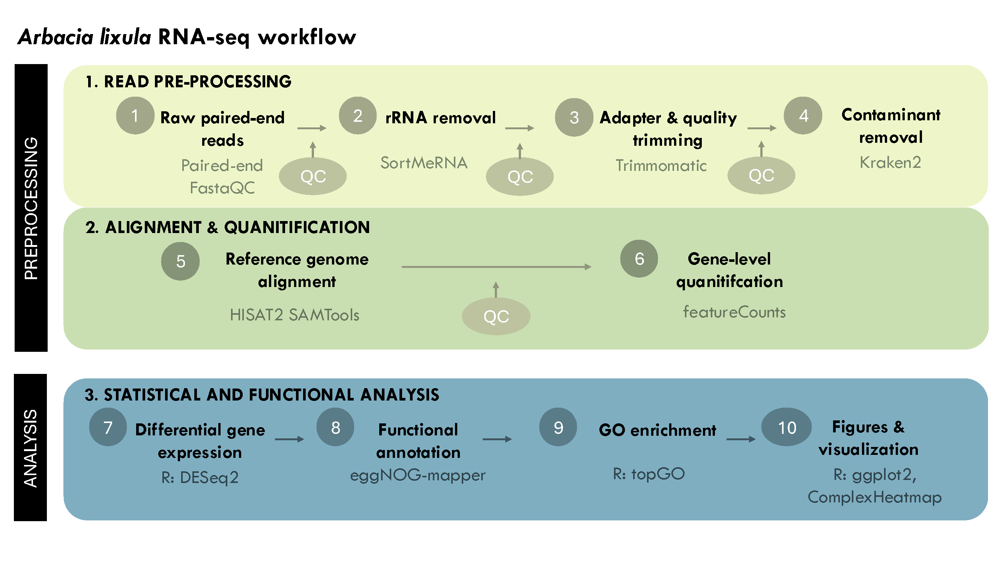

# *Arbacia lixula* transcriptomics

Reproducible RNA-seq preprocessing, differential expression, and functional enrichment workflow supporting:

> Arranz, V., Fernandez-Vilert, R., Hernández, J. C., Pegueroles, C., & Pérez-Portela, R. (2026). **Short-term plasticity and long-term transcriptomic rewiring under natural ocean acidification in an ecosystem-relevant sea urchin.** *Marine Pollution Bulletin*, 231, 119981. [https://doi.org/10.1016/j.marpolbul.2026.119981](https://doi.org/10.1016/j.marpolbul.2026.119981)

## Overview

This repository documents the RNA-seq workflow used to investigate short- and long-term transcriptomic responses of the black sea urchin *Arbacia lixula* to ocean acidification at the natural CO2 vent system of Fuencaliente, La Palma (Canary Islands, Spain).

The study used RNA sequencing from 24 adult sea urchins (eight individuals per group) to distinguish acute transcriptomic plasticity, responses associated with chronic exposure to naturally acidified conditions, and genotype-of-origin effects under a shared low-pH environment.

The complete biological results, figures, and supplementary information are available in the [associated publication](https://doi.org/10.1016/j.marpolbul.2026.119981).

## Experimental design

| Group | Population of origin | Experimental exposure | Biological interpretation |
|---|---|---|---|
| AA | Ambient site | Ambient pH | Ambient reference group |
| AV | Ambient site | Vent-like low pH for 24 h | Acute low-pH exposure |
| VV | Natural CO2 vent | Native vent low pH | Long-term vent exposure |

The three focal contrasts were:

- **AV vs AA:** acute experimental response to low pH.
- **VV vs AA:** differences associated with chronic exposure to natural acidification.
- **VV vs AV:** genotype-of-origin differences under a shared low-pH environment.

## Analysis workflow

The workflow is divided into two main stages:

### A. Preprocessing and alignment 

The `preprocessing/` directory contains the shell scripts used to process
the raw paired-end RNA-seq reads, including quality control, rRNA removal,
adapter and quality trimming, contaminant removal, reference-genome alignment,
and gene-level quantification.

See [`preprocessing/README.md`](preprocessing/README.md) for the required inputs,
analysis order, treatment definitions, and expected outputs.

Because of their size, intermediate FASTQ, BAM, quality-control reports, and
other preprocessing outputs are not stored in this repository. The curated
featureCounts matrix produced by this workflow is provided as
`data/count_curated.csv`.

### B. Statistical and functional analyses

The [`analysis/`](analysis/) directory contains the R Markdown workflows used
for:

1. differential expression analysis with DESeq2;
2. functional annotation with eggNOG-mapper and GO enrichment with topGO;
3. identification and classification of biomineralization-related genes;
4. generation of figures.

These analyses use `data/count_curated.csv`, `data/sample_metadata.csv`, and
the functional annotation files under `data/annotations/`.

See [`analysis/README.md`](analysis/README.md) for the required inputs,
analysis order, treatment definitions, and expected outputs.

## Data availability

The reference genome assembly is available from ENA under accession [CAVLGW020000000](https://www.ebi.ac.uk/ena/browser/view/CAVLGW020000000). The genome annotation used for read quantification is available from the [*Arbacia lixula* genome repository](https://github.com/EvolutionaryGenetics-UB-CEAB/Arbacia_lixula_genome).

Raw reads are deposited in SRA (BioProject [PRJNA1404626](https://www.ncbi.nlm.nih.gov/sra/?term=PRJNA1404626); BioSamples SAMN54720664–SAMN54720687).

Metadata and sample identifiers are provided in Supplementary Table S1.

## Reproducibility

The original analysis scripts are being curated to replace machine-specific paths with configurable project directories and to document software requirements and analytical decisions. Software versions and execution instructions will be recorded alongside the corresponding scripts.

## Citation

If you use this workflow, please cite the associated [Published article](https://doi.org/10.1016/j.marpolbul.2026.119981)

## License

The code and documentation in this repository are distributed under the [MIT License](LICENSE).

## Contact

v.arranz@ub.edu
Vanessa Arranz, PhD
Universitat de Barcelona
